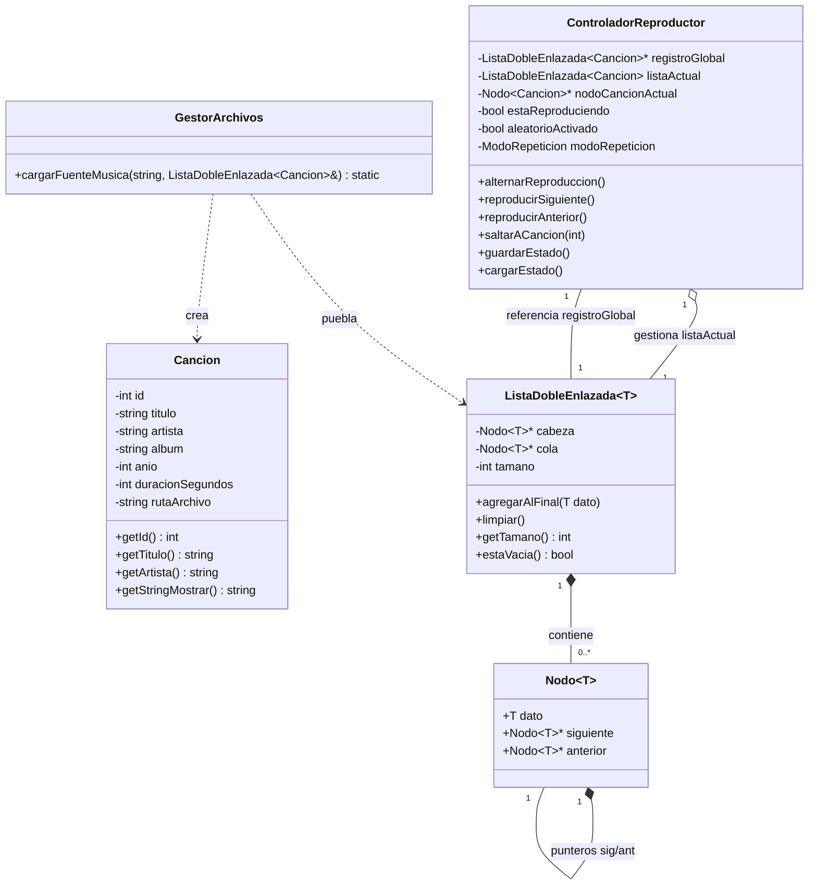

# Reproductor de Música - Taller 1 EDD

**Autor:** Camilo Montalván Aguirre

## Descripción del Proyecto
Este proyecto es un reproductor de música interactivo basado en consola, desarrollado en C++. Implementa la gestión de una lista de reproducción y un registro global de canciones utilizando una lista doblemente enlazada.

## Estructura y Arquitectura
El proyecto está modularizado para mantener un código limpio y escalable:
*   `classes/`: Contiene el modelo de datos (`Cancion`).
*   `data_structures/`: Contiene la implementación manual de los nodos (`Nodo.h`) y la estructura de datos principal (`ListaDobleEnlazada.h`).
*   `core/`: Contiene la lógica de negocio (`GestorArchivos` para la lectura del TXT y `ControladorReproductor` para la lógica de reproducción y persistencia).
*   `music_source.txt`: Base de datos inicial con el listado de canciones disponibles.
*   `status.cfg`: Archivo generado automáticamente para guardar el estado de la reproducción entre sesiones.

Funcionalidades Implementadas
* `W`: Reproducir / Pausar.

* `Q / E`: Navegación (Pista anterior / Pista siguiente). Maneja automáticamente la creación de listas aleatorias si la cola está vacía.

* `S`: Activar / Desactivar modo aleatorio.

* `R`: Ciclar modos de repetición (Desactivado -> Repetir Una -> Repetir Todas).

* `A`: Submenú de la lista de reproducción actual (permite visualizar la cola y saltar a pistas específicas con S<num>).

* `L`: Submenú del registro global (permite ver todas las canciones, reproducir inmediatamente con R<num> o encolar con A<num>).

* `X`: Salir del programa guardando el estado actual (status.cfg). Al volver a ejecutar, el reproductor retomará exactamente donde quedó.

## Diagrama de Clases (UML)



## Instrucciones de Compilación y Ejecución
Para compilar el proyecto en un entorno basado en Unix (Mac/Linux), abre la terminal en la carpeta raíz del proyecto y ejecuta el siguiente comando:

Una vez compilado sin errores, inicia el reproductor con el comando de debajo:

```bash
g++ main.cpp data_structures/MaxHeapCanciones.cpp data_structures/MaxHeapArtistas.cpp classes/Cancion.cpp core/ControladorReproductor.cpp core/GestorArchivos.cpp data_structures/Nodo.cpp data_structures/ListaDobleEnlazada.cpp -o reproductor

./reproductor
```

## Reinicio del Estado y Arranque en frio

El reproductor guarda automáticamente tu última sesión en un archivo físico llamado `status.cfg` cada vez que utilizas la opción **X - Salir**. 

Si deseas probar el programa desde cero y borrar la lista de reproducción y los estados guardados, debes eliminar este archivo antes de ejecutar el reproductor. Puedes hacerlo rápidamente ejecutando el siguiente comando en tu consola:

```bash
rm status.cfg
```


