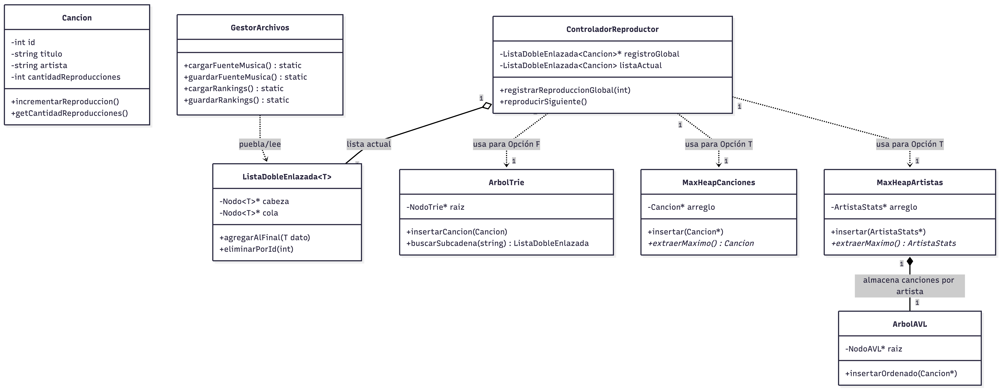

# Reproductor de Música Avanzado (C++) - Taller 2 EDD

**Integrantes del Equipo:** 
Camilo Montalván  (Integración, Persistencia de Datos y Controlador)

Vicente Cárdenas (Estructuras de Búsqueda - Árbol Trie)

Vicente Rojas (Estructuras de Ranking - Árboles Heap y AVL)

## Descripción del Proyecto
Este proyecto es la segunda iteración de un reproductor de música interactivo en consola desarrollado en C++. Extiende la versión base incorporando estructuras de datos arbóreas avanzadas (Trie, Max-Heap y AVL) construidas desde cero sin uso de la STL. Estas estructuras permiten búsquedas ultrarrápidas de strings por subcadenas y generación de rankings (Top 10) en tiempo real, manteniendo la persistencia del estado y el conteo de reproducciones entre sesiones.

## Estructura y Arquitectura
El proyecto está modularizado para mantener un código limpio y escalable:

*   `classes/`: Contiene el modelo de datos (`Cancion`).

*   `data_structures/`: Contiene la implementación manual de los nodos (`Nodo`) y la estructuras de datos definidas como (`ArbolTrie`), (`ListaDobleEnlazada`), (`MaxHeapArtistas`) y (`MaxHeapCanciones`).

*   `core/`: Contiene la lógica de negocio (`GestorArchivos` para la lectura del TXT y `ControladorReproductor` para la lógica de reproducción y persistencia).

*   `music_source.txt`: Base de datos inicial con el listado de canciones disponibles.

*   `status.cfg`: Archivo generado automáticamente para guardar el estado de la reproducción entre sesiones.

Funcionalidades Implementadas
* `W`: Reproducir / Pausar.

* `Q / E`: Saltar a pista Anterior / Siguiente.

* `S / R`: Control de modo Aleatorio y modos de Repetición (Una/Todas).

* `A`: Ver la cola de la lista de reproducción actual.

* `L`: Ver la biblioteca global completa.

* `N / D`: Agregar una nueva canción al sistema o Eliminarla por ID.

* `F`: Búsqueda inteligente de canciones o artistas mediante la inserción de texto. Utiliza un Árbol Trie para buscar coincidencias por subcadena de forma eficiente.

* `T`: Visualización de Rankings. Emplea árboles Max-Heap para extraer en orden de mayor a menor las 10 canciones y los 10 artistas más escuchados. Las canciones de cada artista se mantienen en estricto orden alfabético usando un Árbol AVL.

* `X`: Guarda la sesión actual (status.cfg) y los contadores de reproducciones (song_ranking.txt).

## Arquitectura y Diagrama de Clases (UML)

A continuación se detalla la arquitectura del sistema en una imagen de un diagrama de clases UML.



## Instrucciones de Compilación y Ejecución
Para compilar en Windows, se recomienda utilizar Git Bash, el terminal integrado de VS Code, o tener un entorno como MinGW/MSYS2 configurado en las variables de entorno.

1. Abre tu terminal en la raíz del proyecto.

2. Ejecuta el comando de limpieza por seguridad:
make clean
(Nota: Si utilizas MinGW en CMD clásico, es posible que el comando que debas usar sea mingw32-make clean)

3. Compila el proyecto completo:
make

4. Ejecuta el reproductor generado:
reproductor.exe
(O ./reproductor.exe si te encuentras utilizando Git Bash)

```bash
make clean 
make
reproductor.exe
```
